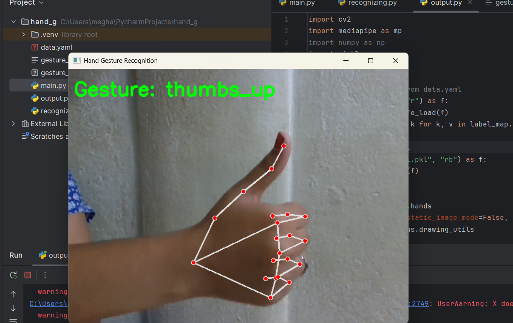

# ✋ Hand Gesture Recognition using MediaPipe & Machine Learning

A real-time hand gesture recognition system using a webcam, [MediaPipe](https://google.github.io/mediapipe/), and a machine learning model (Random Forest). The system detects hand landmarks and classifies gestures like `thumbs_up`, `peace`, and `fist`.

 <!-- Optional: Add a demo gif or image here -->

---

## 📌 Features

- 👋 Real-time gesture recognition using webcam
- 🧠 Trains a machine learning model using collected hand landmark data
- 🖼️ Visualizes detected gestures with overlay text
- 🔄 Easily add more gestures via a YAML label file

---

## 🛠️ Tech Stack

- **Python 3.10+**
- [MediaPipe](https://google.github.io/mediapipe/) for hand tracking
- OpenCV for webcam and image display
- Scikit-learn for gesture classification
- Pandas & NumPy for data handling
- YAML for gesture label config

---
## 🔍 Demo Output

Here’s the real-time output of the gesture recognition:

### 🖼️ Screenshot

